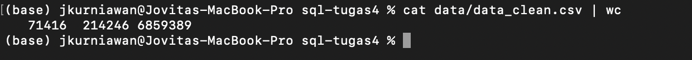

## Project SQL: Cleaning E-commerce Traffic Data in Shell

E-commerce traffic data for the month of October and November 2019 were given. The data will be cleaned to generate insights on products that were purchased during that period.

### Objective

Learning Objective:
* Apply bash scripting to process data
* Apply csvkit command to process data
* Perform data cleaning in shell
* Utilize Git VCS as repository

Analysis Objective:
* To analyze top categories and products purchased in Oct-Nov 2019.

### Technologies Used

_Please ensure you have all these installed into your computer_

Packages:
* Csvkit
* Git
* Wget
* Unzip

Tools 
* Terminal: to process data
* Github: to upload project repository

### Content

1. README.MD
2. data_clean.sh: script to download, clean data
3. test.sh : script to run test cases
4. img: screenshot of test cases outputs

1. README.MD
2. data_clean.sh: script to download, clean data
3. test.sh : script to run test cases
4. img: screenshot of test cases outputs

### Task Breakdown

1. Initialize variable   
DIR="/Users/jkurniawan/sql-tugas4"   
FILEID=1rKkUQU-sXIDka3rVNBahp6q3wDhrPY-1 
FILENAME="data.zip"  
CLEAN_DATA="data/data_clean.csv"  

2. Checking for project directory 
if [[ -d "$DIR" ]]; then  
        echo "SQL Project 4 folder has been created" 
else  
        echo "Not found - creating project folder" 
        mkdir /Users/jkurniawan/sql-tugas4 
fi    

3. Using "wget" to download sample data from google drive and "unzip" to extract csv files

Query: Download Sample Data From Google Drive 

if [[ -f "$DIR/data.zip" ]]; then 
        echo "Sample data has been downloaded from Google Drive" 
else 
        echo "Downloading sample data from Google Drive .." 
        wget -P $DIR --no-check-certificate --load-cookies /tmp/cookies.txt "https://drive.google.com/uc?export=download&confirm=true$(wget --quiet --save-cookies /tmp/cookies.txt --keep-session-cookies --no-check-certificate 'https://drive.google.com/uc?export=download&id=$FILEID' -O- | sed -rn 's/.*confirm=([0-9A-Za-z_]+).*/\1\n/p')&id=$FILEID" -O $FILENAME && rm -rf /tmp/cookies.txt 
fi 

Query: Unzip files 
if [[ -d "$DIR/data" ]];then  
        echo "Sample data has been unzipped" 
else  
        echo "Unziping sample data downloaded" 
        unzip $FILENAME -d $DIR  
        rm -f $DIR/data.zip  
        echo "Unzipping done - 2 csv sample data download into data folders" 
fi  

4. Cleaning Data  
Query: 
if [[ -f "$DIR/$CLEAN_DATA" ]]; then 
        echo "Data has been cleaned - in this directory: $CLEAN_DATA" 
else  
        echo "Data has not been cleaned - cleaning data" 
        echo "Combining 2019 Oct and Nov sample data and filtering for purchase only" 
        csvstack $DIR/data/2019-Oct-sample.csv $DIR/data/2019-Nov-sample.csv | csvcut -c 2,3,4,5,7,8,6 | csvgrep -c 2 -m "purchase" > $DIR/combined.csv
    echo "Spliting category_id into category and product_name" 
        csvcut -c 7 $DIR/combined.csv | grep -oE '^(\w+)' > $DIR/category.csv 
        csvcut -c 7 $DIR/combined.csv | grep -oE '\b(\w+)$' > $DIR/product_name.csv 
        cat $DIR/product_name.csv | cat $DIR/category.csv | pr -mts, $DIR/category.csv $DIR/product_name.csv > $DIR/category_split.csv
        echo "Selecting relevant columns" 
        cat $DIR/combined.csv | cat $DIR/category_split.csv | pr -mts, $DIR/combined.csv $DIR/category_split.csv > $DIR/final_clean.csv 
        csvcut -c 1,2,3,4,5,6,8,9 $DIR/final_clean.csv > $DIR/clean2.csv 
        (echo 'event_time,event_type,product_id,category_id,brand,price,category,product_name' ; cat $DIR/clean2.csv;) > $DIR/clean3.csv 
        sed '2d' $DIR/clean3.csv > $DIR/$CLEAN_DATA 
        rm -f $DIR/combined.csv  
        rm -f $DIR/category.csv  
        rm -f $DIR/product_name.csv  
        rm -f $DIR/category_split.csv  
        rm -f $DIR/final_clean.csv  
        rm -f $DIR/clean2.csv  
        rm -f $DIR/clean3.csv   
        echo "Data cleaning has been completed"  
fi  

5. Display First 10 Data Entries  
echo "Printing first 10 entries of data..."  

csvlook $DIR/$CLEAN_DATA | head  

echo "Done..."  

### Guides to "Try it yourself" :)

1. Open terminal on your computer - make sure your pwd is at home "~" 
2. Ensure you have set up SSH Key 
3. Copy SSH link from git hub
4. Copy to terminal: git clone <SSH link> <local repository name>
5. On terminal: cd <local repository name>
6. Open data_clean.sh script
7. Change DIR to be destination directory for the project in your local computer

_Please run these test cases after you have successfully setup the project_

_Note:_
* open test.sh script
* change DIR to be project directory in your local computer (same as step 7 in prev section)
* on your terminal: bash test.sh

_Results_
1. Test case 1: validating word count for combined sample data
* Query: cat ${DIR}/data_clean.csv | wc
* Expected output:

2. Test case 2: validating for purchase count based on product category & name
* Query: cat ${DIR}/data_clean.csv | grep electronics | grep smartphone| awk -F ',' '{print $5}'| sort | uniq -c | sort -nr
* Expected output:

### Author
Copyright (c) _2022_ _Jovita Kurniawan_
