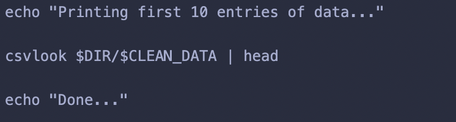

## Project SQL: Cleaning E-commerce Traffic Data in Shell

E-commerce traffic data for the month of October and November 2019 were given. The data will be cleaned to generate insights on products that were purchased during that period.

### Objective

Learning Objective:
* Apply bash scripting to process data
* Apply csvkit command to process data
* Perform data cleaning in shell
* Utilize Git VCS as repository

Analysis Objective:
* To analyze top categories and products purchased in Oct-Nov 2019.

### Technologies Used

_Please ensure you have all these installed into your computer_

Packages:
* Csvkit
* Git
* Wget
* Unzip

Tools 
* Terminal: to process data
* Github: to upload project repository

### Content

1. README.MD
2. data_clean.sh: script to download, clean data
3. test.sh : script to run test cases
4. img: screenshot of test cases outputs

### Task Breakdown

1. Initialize variable

Query:

2. Checking for project directory

Query:

3. Using "wget" to download sample data from google drive and "unzip" to extract csv files

Query: Download Sample Data From Google Drive 

Query: Unzip files

4. Cleaning Data

Query: 

5. Display First 10 Data Entries

Query:

### Guides to "Try it yourself" :)

1. Open terminal on your computer - make sure your pwd is at home "~" 
2. Ensure you have set up SSH Key 
3. Copy SSH link from git hub
4. Copy to terminal: git clone <SSH link> <local repository name>
5. On terminal: cd <local repository name>
6. Open data_clean.sh script
7. Change DIR to be destination directory for the project in your local computer

### Validation

_Please run these test cases after you have successfully setup the project_

_Setup:_
* open test.sh script
* change DIR to be project directory in your local computer (same as step 7 in prev section)
* on your terminal: bash test.sh

_Results_
1. Test case 1: validating word count for combined sample data
* Query: cat ${DIR}/data_clean.csv | wc
* Expected output:

2. Test case 2: validating for purchase count based on product category & name
* Query: cat ${DIR}/data_clean.csv | grep electronics | grep smartphone| awk -F ',' '{print $5}'| sort | uniq -c | sort -nr
* Expected output:

### Author
Copyright (c) _2022_ _Jovita Kurniawan_
