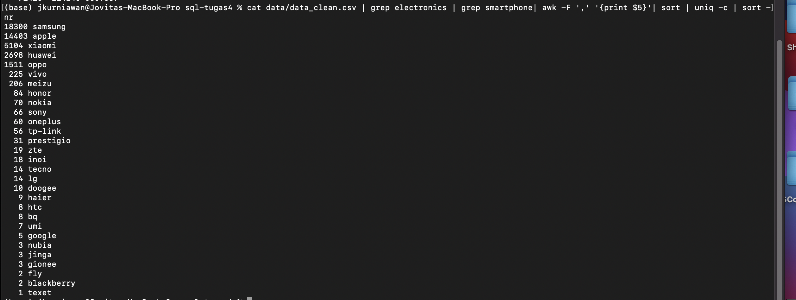

## Project SQL: Cleaning E-commerce Traffic Data in Shell

E-commerce traffic data for the month of October and November 2019 were given. The data will be cleaned to generate insights on products that were purchased during that period. 

### Objective

Learning Objective: 
* Apply bash scripting to process data
* Apply csvkit command to process data 
* Perform data cleaning in shell
* Utilize Git VCS as repository 

Analysis Objective: 
* To analyze top categories and products purchased in Oct-Nov 2019.

### Technologies Used 

_Please ensure you have all these installed into your computer_

Packages:
* Csvkit
* Git
* Wget
* Unzip 

Tools  
* Terminal: to process data 
* Github: to upload project repository

### Task Breakdown

1. Initialize variable 
DIR="/Users/jkurniawan/sql-tugas4"
FILEID=1rKkUQU-sXIDka3rVNBahp6q3wDhrPY-1
FILENAME="data.zip"
CLEAN_DATA="data/data_clean.csv"

2. Checking for project directory
if [[ -d "$DIR" ]]; then
        echo "SQL Project 4 folder has been created"
else
        echo "Not found - creating project folder"
        mkdir /Users/jkurniawan/sql-tugas4
fi

3. Using "wget" to download sample data from google drive and "unzip" to extract csv files

Query: Download Sample Data From Google Drive

if [[ -f "$DIR/data.zip" ]]; then
        echo "Sample data has been downloaded from Google Drive"
else
        echo "Downloading sample data from Google Drive .."
        wget -P $DIR --no-check-certificate --load-cookies /tmp/cookies.txt "https://drive.google.com/uc?export=download&confirm=true$(wget --quiet --save-cookies /tmp/cookies.txt --keep-session-cookies --no-check-certificate 'https://drive.google.com/uc?export=download&id=$FILEID' -O- | sed -rn 's/.*confirm=([0-9A-Za-z_]+).*/\1\n/p')&id=$FILEID" -O $FILENAME && rm -rf /tmp/cookies.txt
fi

Query: Unzip files 
if [[ -d "$DIR/data" ]];then
        echo "Sample data has been unzipped"
else
        echo "Unziping sample data downloaded"
        unzip $FILENAME -d $DIR
	rm -f $DIR/data.zip
	echo "Unzipping done - 2 csv sample data download into data folders"
fi

4. Cleaning Data
Query: 
if [[ -f "$DIR/$CLEAN_DATA" ]]; then
        echo "Data has been cleaned - in this directory: $CLEAN_DATA"
else
        echo "Data has not been cleaned - cleaning data"
	echo "Combining 2019 Oct and Nov sample data and filtering for purchase only"
	csvstack $DIR/data/2019-Oct-sample.csv $DIR/data/2019-Nov-sample.csv | csvcut -c 2,3,4,5,7,8,6 | csvgrep -c 2 -m "purchase" > $DIR/combined.csv
    echo "Spliting category_id into category and product_name"
	csvcut -c 7 $DIR/combined.csv | grep -oE '^(\w+)' > $DIR/category.csv
	csvcut -c 7 $DIR/combined.csv | grep -oE '\b(\w+)$' > $DIR/product_name.csv
	cat $DIR/product_name.csv | cat $DIR/category.csv | pr -mts, $DIR/category.csv $DIR/product_name.csv > $DIR/category_split.csv
	echo "Selecting relevant columns"
	cat $DIR/combined.csv | cat $DIR/category_split.csv | pr -mts, $DIR/combined.csv $DIR/category_split.csv > $DIR/final_clean.csv
	csvcut -c 1,2,3,4,5,6,8,9 $DIR/final_clean.csv > $DIR/clean2.csv
	(echo 'event_time,event_type,product_id,category_id,brand,price,category,product_name' ; cat $DIR/clean2.csv;) > $DIR/clean3.csv
	sed '2d' $DIR/clean3.csv > $DIR/$CLEAN_DATA
	rm -f $DIR/combined.csv
	rm -f $DIR/category.csv
	rm -f $DIR/product_name.csv
	rm -f $DIR/category_split.csv
	rm -f $DIR/final_clean.csv 
	rm -f $DIR/clean2.csv
	rm -f $DIR/clean3.csv	
        echo "Data cleaning has been completed"
fi

5. Display First 10 Data Entries 
echo "Printing first 10 entries of data..."

csvlook $DIR/$CLEAN_DATA | head

echo "Done..."

### Guides to "Try it yourself" :)

1. Pull from Github
2. Change DIR to be your project directory in your local computer

### Validation

_Please run these test cases after you have successfully setup the project_

1. Test case 1: validating word count for combined sample data
* Run the query on your terminal: cat ${DIR}/data_clean.csv | wc 
* Expected output: 

2. Test case 2: validating for purchase count based on product category & name
* Run the query on your terminal: cat ${DIR}/data_clean.csv | grep electronics | grep smartphone| awk -F ',' '{print $5}'| sort | uniq -c | sort -nr
* Expected output: 

### Author
Copyright (c) _2022_ _Jovita Kurniawan_

